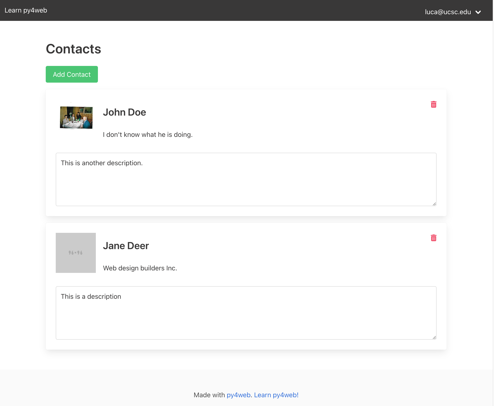

# Contact Cards App

Write a contact cards app using Vue.js and the provided starter code
(pay attention to the classes, as they 
are used in testing).

The app allows users to store contact cards. 
Each contact card should have the following fields:
- Name: This is an input field with name `name`.
- Affiliation: This is an input field with name `affiliation`.
- Description: this is a textarea with name `description`.
- A photo, which is an  tag with class `photo` inside a `<figure>` tag with class `photo`. 

The contacts of each user should be stored in the database, associated with the user.
Different users should have different contacts, of course. 

## Features

### Adding a contact

On top of the list of contacts, there should be a button to add a contact, with id `add_button`. 
When the button is clicked, a new contact card should be added to the end of the list. 
The new card should be initially empty: it should contain a placeholder image (link to `https://bulma.io/assets/images/placeholders/96x96.png`), and the other fields should be empty, with placeholders Name, Affiliation, and Description.

### Deleting a contact

Each contact card should have a button to delete it, with class `delete_button`. 
When the button is clicked, the contact card should be removed from the list.

### Editing a contact

All contacts should be editable in place.  Specifically, the input fields should be normally read-only (have the `readonly` attribute). 
When a user clicks on a field, the field becomes editable  (does not have the `readonly` attribute).  The user can then input characters, and when the field loses focus, the changes should be saved to the database.  This should hold for the name, affiliation, and description fields.

For the contact image, when someone clicks on the `<figure>` tag, a file dialog should open, allowing the user to select a new image.  The image should be uploaded to the server, and the new image should be displayed in the contact card.
The trick to obtaining this behavior is as follows. 
First, ensure that you have a single input field that acts as file selector at the top of your HTML file:

```html
<input type="file" id="file-input" style="display: none"
accept=".jpg, .png, .jpeg, .gif, .bmp, .tif, .tiff|image/*">
```

Second, when the figure is clicked, you should trigger a click on the input field:

```javascript
choose_image: function (contact) {
    let input = document.getElementById("file-input");
    input.onchange = function () {
        let file = input.files[0];
        if (file) {
            // Read the file as data url, and upload the resulting
            // string to the contact. 
        }
    };
    input.click();
}
```

## Implementation

To run py4web, you can do: 

    ./py4web.sh

The app will be available at http://localhost:8000/contact_cards.
Of course, do look into that script.  All it does is to run the command: 

    py4web run --errorlog=:stdout -L 20 apps

where the options are to optimize logging. 

You should only modify the following files:
- `static/js/index.js`
- `templates/index.html`
- `controllers.py`
- `models.py`

To implement the app, you should follow these steps:
- First, define in `models.py` the database model. 
- In `controllers.py`, create the necessary routes to serve the index page and the API for the contacts.
- In `templates/index.html`, implement the HTML for the contacts, using Vue3. 
- In `static/js/index.js`, implement the Vue.js app.

## Grading

You can grade the assignment yourself, like this: 

    python grade.py

The grading is as follows.  8 points are assigned automatically via the grading script: 

- 1 point: it is possible to add an empty contact.
- 1 point: the name and affiliation are initially read-only. They become editable when someone clicks on it, and become read-only again when they loses focus. When the fields are editable, they can be edited. 
- 1 point: the description is initially read-only. It becomes editable when someone clicks on it, and becomes read-only when it loses focus.
- 1 point: changes to the name, affiliation, description, are saved in the database.
- 1 point: changes are stored correctly even when multiple contacts are present. 
- 1 point: the image can be changed by clicking on the figure tag, and the new image is saved in the database.
- 1 point: different users have different contacts. 
- 1 point: the delete button works correctly.

The remaining 2 points are assigned manually, and are based on: 

- 1 point: quality of the code. 
- 1 point: only the contact owners can update or delete contacts (there are checks on the server side for these operations).

## Killing old servers

Sometimes, you may need to kill old servers.  You can list the old servers via: 

    ps aux | grep 'py4web'

If you have more than one server associated with port 8800, a new server 
will not be created, and this is a common source of errors.  You can kill 
all leftover py4web servers via:

    pkill -f 'py4web'

## Submission

To submit, first crete the zip file, via: 

    python zipit.py

This creates the file `submission.zip`.  Submit this file to the Google Form, and **be sure to press SUBMIT on the form**.  Just uploading the file to the form is not enough. 

## Sample solution

This how the instructor solution looks like: 

